# Introduction to Naming Schemes, Networks, Clients and Services with Java

**Asignatura:** Arquitecturas de Software (ARSW) — Escuela Colombiana de Ingeniería  
**Autor:** Brayan Loaiza  
**Periodo:** 2026-i

---

## Descripcion general

Este taller introduce los conceptos fundamentales de redes en Java: nomenclatura de URLs, comunicacion cliente-servidor via TCP y UDP, construccion de un servidor HTTP desde cero, y llamadas a metodos remotos (RMI). Cada ejercicio construye sobre el anterior, escalando desde simples consultas de propiedades de una URL hasta una aplicacion de chat distribuida.

---

## Estructura del repositorio

```
src/
├── Ejercicio_1/   URLInfo.java            — Lectura de componentes de una URL
├── Ejercicio_2/   Browser.java            — Navegador simple por consola
├── Ejercicio_3/   SquareServer.java       — Servidor TCP: cuadrado de un numero
│                  SquareClient.java
├── Ejercicio_4/   TrigServer.java         — Servidor TCP: funciones trigonometricas
│                  TrigClient.java
├── Ejercicio_5/   HttpServer.java         — Servidor HTTP que sirve archivos reales
│                  www/index.html
│                  www/pagina2.html
├── Ejercicio_6/   TimeServer.java         — Servidor UDP de hora del sistema
│                  TimeClient.java
├── Ejercicio_7/   ChatInterface.java      — Chat distribuido via RMI
│                  ChatImpl.java
│                  ChatServer.java
│                  ChatClient.java
└── image/                                 — Capturas de evidencia de cada ejercicio
```

---

## Ejercicio 1 — Lectura de componentes de una URL

### Concepto

La clase `java.net.URL` de Java permite descomponer cualquier URL en sus partes constitutivas. Este ejercicio demuestra los 8 componentes que se pueden extraer y clarifica la diferencia entre campos como `file` (path + query) y `path` (solo la ruta).

### URL analizada

```
http://ldbn.escuelaing.edu.co:80/index.html?query=test#seccion1
```

### Salida esperada

| Campo | Metodo | Valor |
|-------|--------|-------|
| Protocolo | `getProtocol()` | `http` |
| Authority | `getAuthority()` | `ldbn.escuelaing.edu.co:80` |
| Host | `getHost()` | `ldbn.escuelaing.edu.co` |
| Puerto | `getPort()` | `80` |
| Path | `getPath()` | `/index.html` |
| Query | `getQuery()` | `query=test` |
| File | `getFile()` | `/index.html?query=test` |
| Ref | `getRef()` | `seccion1` |

### Como ejecutar

```bash
javac URLInfo.java
java URLInfo
```

### Evidencia


---

## Ejercicio 2 — Navegador simple por consola

### Concepto

`URL.openStream()` permite obtener el cuerpo de una respuesta HTTP sin necesidad de abrir un socket manualmente ni parsear cabeceras. Este ejercicio lo usa para implementar un navegador minimalista que descarga el HTML de cualquier URL y lo guarda en disco.

### Funcionamiento

1. El usuario ingresa una URL por consola.
2. El programa abre un stream hacia esa URL.
3. Lee cada linea y la escribe en `resultado.html`.

### Como ejecutar

```bash
javac Browser.java
java Browser
# Ingrese la dirección URL: https://www.escuelaing.edu.co
```

### Evidencia

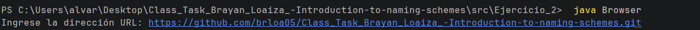
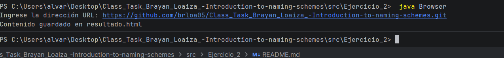
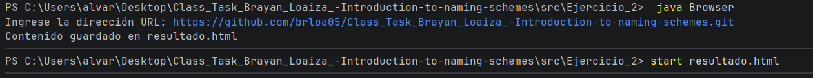
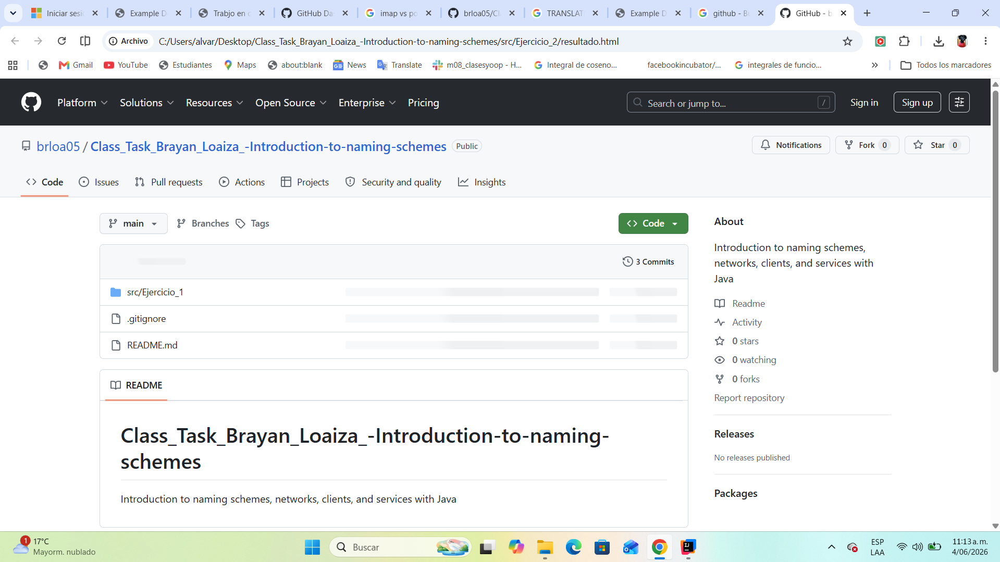

---

## Ejercicio 3 — Servidor TCP: cuadrado de un numero

### Concepto

Introduce la programacion cliente-servidor con `ServerSocket` (TCP). El servidor queda a la escucha en un puerto, acepta una conexion, recibe numeros enviados por el cliente y responde con el cuadrado de cada uno.

### Protocolo

- **Puerto:** `35000`
- **Flujo:** cliente envia un numero por linea → servidor responde `"El cuadrado de X es: Y"`.
- Admite multiples numeros en la misma sesion hasta que el cliente cierra la conexion.
- Si el texto enviado no es un numero, el servidor responde con un mensaje de error.

### Como ejecutar

```bash
# Terminal 1 — servidor
javac SquareServer.java
java SquareServer

# Terminal 2 — cliente
javac SquareClient.java
java SquareClient
```

### Evidencia

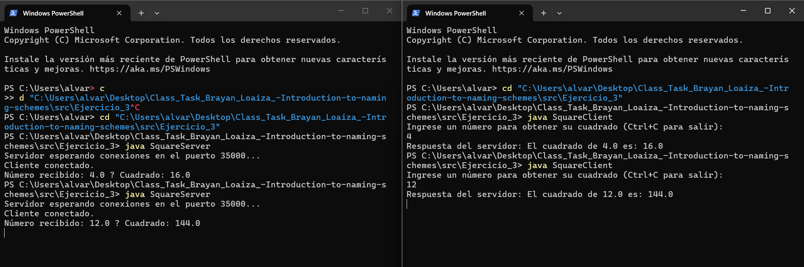

---

## Ejercicio 4 — Servidor TCP: funciones trigonometricas

### Concepto

Extension del ejercicio anterior. El servidor calcula funciones trigonometricas (seno, coseno, tangente) sobre angulos en radianes enviados por el cliente. El protocolo incluye un comando especial `fun:<nombre>` para cambiar la funcion activa en caliente sin reiniciar la sesion.

### Protocolo

- **Puerto:** `35000`
- **Funcion por defecto:** coseno
- **Cambiar funcion:** enviar `fun:sin`, `fun:cos` o `fun:tan`
- **Calcular:** enviar cualquier numero decimal (en radianes)

**Ejemplo de sesion:**

```
fun:sin
→ Función cambiada a: sin
1.5708
→ sin(1.5708) = 1.0
fun:tan
0.7854
→ tan(0.7854) = 0.9999...
```

### Como ejecutar

```bash
# Terminal 1
javac TrigServer.java && java TrigServer

# Terminal 2
javac TrigClient.java && java TrigClient
```

### Evidencia


---

## Ejercicio 5 — Servidor HTTP que sirve archivos reales

### Concepto

Implementacion de un servidor HTTP/1.1 construido desde cero sobre sockets TCP. A diferencia de los ejercicios anteriores, este servidor:

- Parsea la linea de solicitud HTTP (`GET /ruta HTTP/1.1`).
- Lee el archivo solicitado desde la carpeta `www/` en disco.
- Construye cabeceras HTTP correctas (`Content-Type`, `Content-Length`, codigo de estado).
- Detecta el tipo MIME segun la extension del archivo.
- Responde `404 Not Found` si el archivo no existe.
- Acepta conexiones en **bucle infinito** (multiples solicitudes consecutivas sin reiniciar).

### Tipos MIME soportados

| Extension | Content-Type |
|-----------|-------------|
| `.html` / `.htm` | `text/html` |
| `.css` | `text/css` |
| `.js` | `application/javascript` |
| `.png` | `image/png` |
| `.jpg` / `.jpeg` | `image/jpeg` |
| `.gif` | `image/gif` |
| `.ico` | `image/x-icon` |
| otros | `application/octet-stream` |

### Paginas incluidas

- `http://localhost:35000/` → `index.html` (pagina principal)
- `http://localhost:35000/pagina2.html` → segunda pagina con navegacion de vuelta

### Como ejecutar

```bash
# Desde la carpeta Ejercicio_5/
javac HttpServer.java
java HttpServer
# Luego abrir el navegador en http://localhost:35000
```

### Evidencia

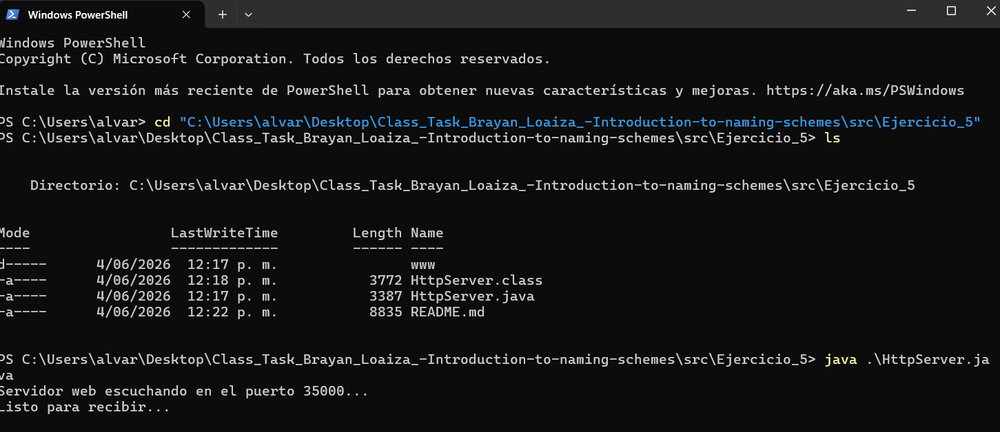
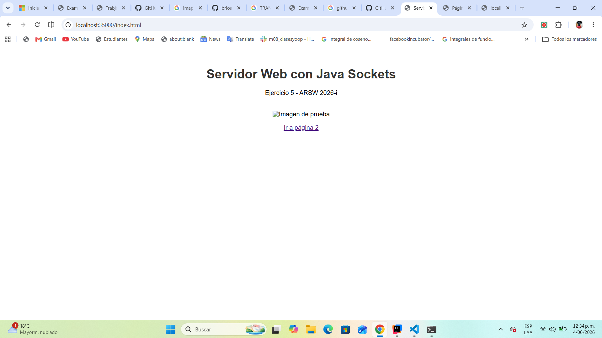
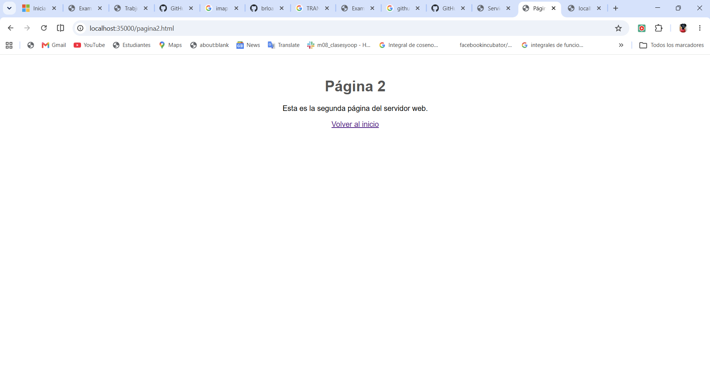
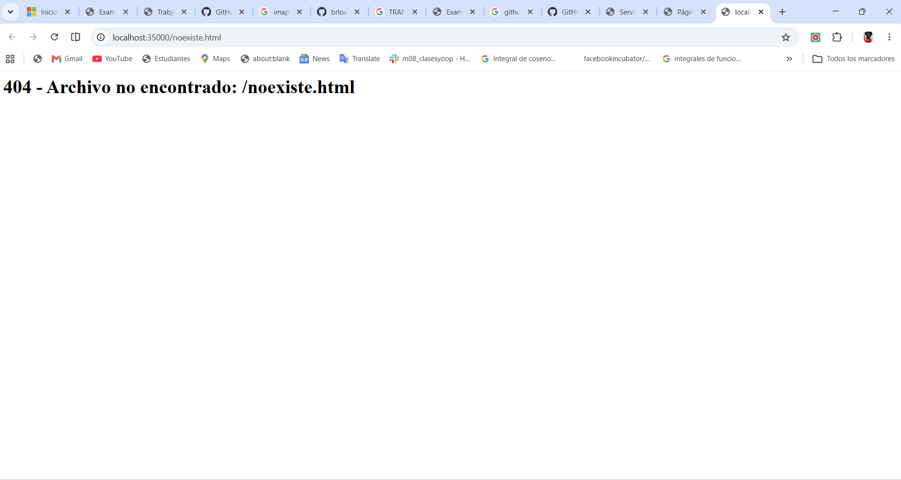
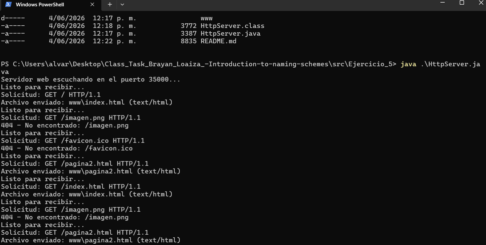

---

## Ejercicio 6 — Servidor UDP de hora del sistema

### Concepto

Introduce el protocolo **UDP** (`DatagramSocket` / `DatagramPacket`). A diferencia de TCP, UDP no establece conexion; cada mensaje es un paquete independiente. Este ejercicio implementa un servidor de tiempo al que el cliente consulta periodicamente.

### Caracteristicas del cliente

- Consulta la hora cada **5 segundos** de forma automatica.
- Tiene un **timeout de 3 segundos** por solicitud: si el servidor no responde, imprime `[TIMEOUT]` y reintenta en el siguiente ciclo sin bloquearse indefinidamente.
- Tolerante a fallos: si el servidor esta caido, el cliente sigue corriendo y reintenta.

### Protocolo

- **Puerto servidor:** `45000` (UDP)
- **Mensaje del cliente:** `"GET_TIME"`
- **Respuesta del servidor:** `"Hora del servidor: <fecha y hora actual>"`

### Como ejecutar

```bash
# Terminal 1
javac TimeServer.java && java TimeServer

# Terminal 2
javac TimeClient.java && java TimeClient
```

### Evidencia

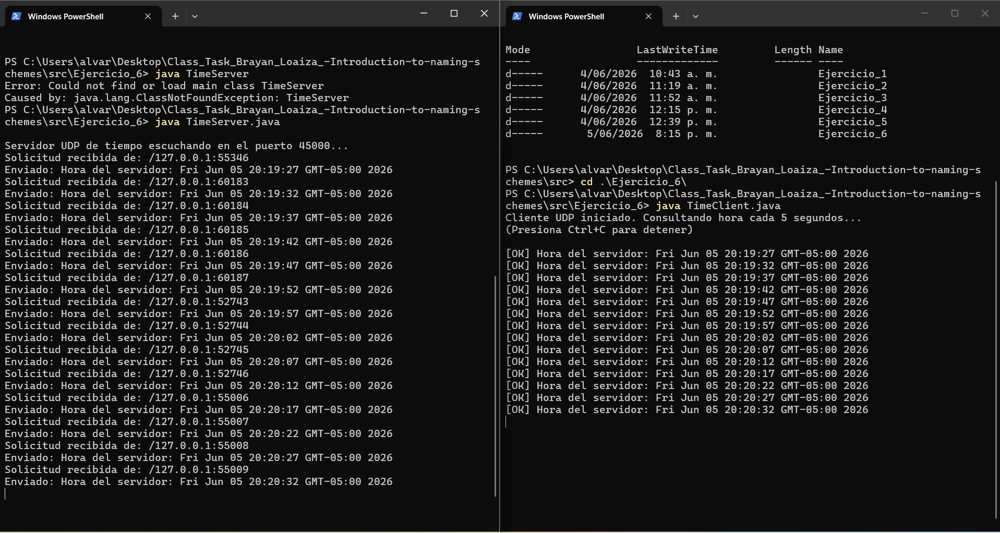

---

## Ejercicio 7 — Chat distribuido con RMI

### Concepto

**RMI (Remote Method Invocation)** permite invocar metodos de un objeto que vive en otra JVM como si fueran locales. Este ejercicio implementa un chat donde los clientes llaman metodos del servidor remotamente sin gestionar sockets a mano.

### Arquitectura

```
ChatInterface  (contrato remoto — extiende Remote)
     ↑
ChatImpl       (implementacion en el servidor — extiende UnicastRemoteObject)
     ↑
ChatServer     (registra el servicio en el RMI Registry en el puerto 1099)
ChatClient     (localiza el servicio y llama sus metodos remotamente)
```

### API remota

```java
void enviarMensaje(String mensaje, String emisor) throws RemoteException;
String[] obtenerMensajes()                         throws RemoteException;
```

### Funcionamiento

1. `ChatServer` publica el objeto `ChatImpl` en el RMI Registry bajo el nombre `"ChatService"`.
2. Cada `ChatClient` pide su nombre al usuario, luego envia mensajes llamando `chat.enviarMensaje(mensaje, nombre)`.
3. El servidor mantiene un historial en memoria (`List<String>`) y lo imprime por consola en tiempo real.
4. El cliente escribe `salir` para desconectarse.

### Como ejecutar

```bash
# Terminal 1 — servidor
javac ChatInterface.java ChatImpl.java ChatServer.java
java ChatServer

# Terminal 2 y 3 — clientes (pueden correr varios en paralelo)
javac ChatInterface.java ChatClient.java
java ChatClient
```

### Evidencia

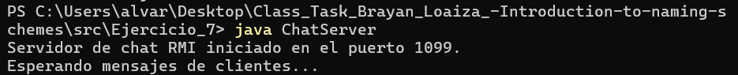
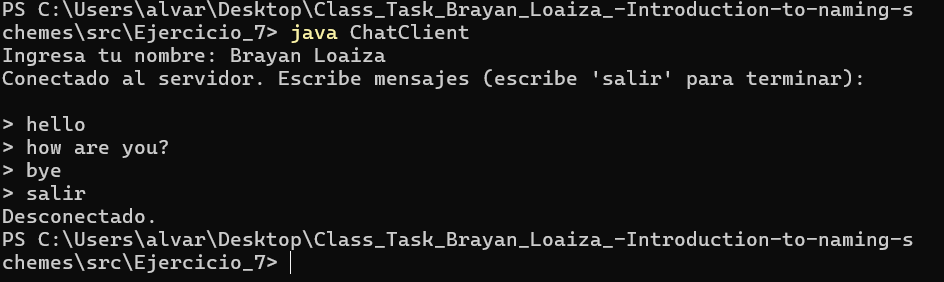
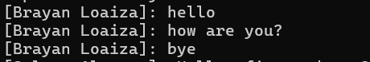
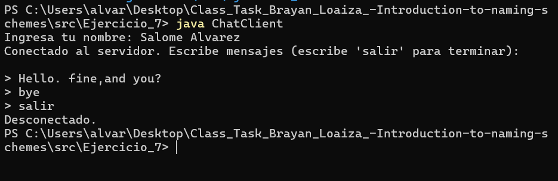
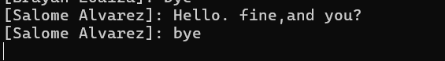

---

## Resumen de tecnologias por ejercicio

| # | Clase(s) clave | Protocolo | Puerto |
|---|---------------|-----------|--------|
| 1 | `java.net.URL` | — | — |
| 2 | `URL.openStream()` | HTTP | — |
| 3 | `ServerSocket`, `Socket` | TCP | 35000 |
| 4 | `ServerSocket`, `Socket` | TCP | 35000 |
| 5 | `ServerSocket`, `Socket`, `Files` | HTTP/1.1 sobre TCP | 35000 |
| 6 | `DatagramSocket`, `DatagramPacket` | UDP | 45000 |
| 7 | `UnicastRemoteObject`, `Registry` | RMI (sobre TCP) | 1099 |

## Requisitos

- Java 8 o superior
- Compilacion con `javac`, ejecucion con `java` (sin dependencias externas)
