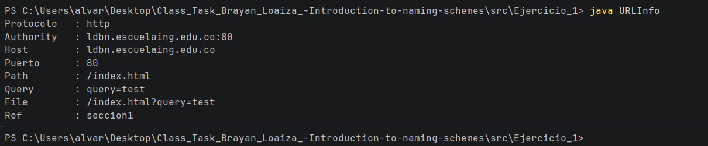

# Ejercicio 1 - Leyendo los valores de un objeto URL

## Descripción

Programa en Java que crea un objeto `URL` e imprime en pantalla los valores retornados por los 8 métodos de lectura disponibles en la clase `java.net.URL`.

---

## Solución

### Enfoque

Se instancia un objeto `URL` con una dirección que contenga todos los componentes posibles (protocolo, host, puerto, path, query y fragmento), para que cada método retorne un valor visible al ejecutar el programa.

### Clase: `URLInfo.java`

```java
import java.net.MalformedURLException;
import java.net.URL;

public class URLInfo {
    public static void main(String[] args) {
        try {
            URL url = new URL("http://ldbn.escuelaing.edu.co:80/index.html?query=test#seccion1");

            System.out.println("Protocolo   : " + url.getProtocol());
            System.out.println("Authority   : " + url.getAuthority());
            System.out.println("Host        : " + url.getHost());
            System.out.println("Puerto      : " + url.getPort());
            System.out.println("Path        : " + url.getPath());
            System.out.println("Query       : " + url.getQuery());
            System.out.println("File        : " + url.getFile());
            System.out.println("Ref         : " + url.getRef());

        } catch (MalformedURLException e) {
            e.printStackTrace();
        }
    }
}
```

### Los 8 métodos utilizados

| Método | Descripción | Ejemplo retornado |
|--------|-------------|-------------------|
| `getProtocol()` | Protocolo de la URL | `http` |
| `getAuthority()` | Host + puerto | `ldbn.escuelaing.edu.co:80` |
| `getHost()` | Nombre del servidor | `ldbn.escuelaing.edu.co` |
| `getPort()` | Número de puerto | `80` |
| `getPath()` | Ruta del recurso | `/index.html` |
| `getQuery()` | Parámetros de consulta | `query=test` |
| `getFile()` | Path completo + query | `/index.html?query=test` |
| `getRef()` | Fragmento / ancla | `seccion1` |

---

## Cómo ejecutar

```bash
javac URLInfo.java
java URLInfo
```

---

## Evidencia de ejecución

<!-- Reemplaza esta línea con la captura de pantalla de la ejecución -->

