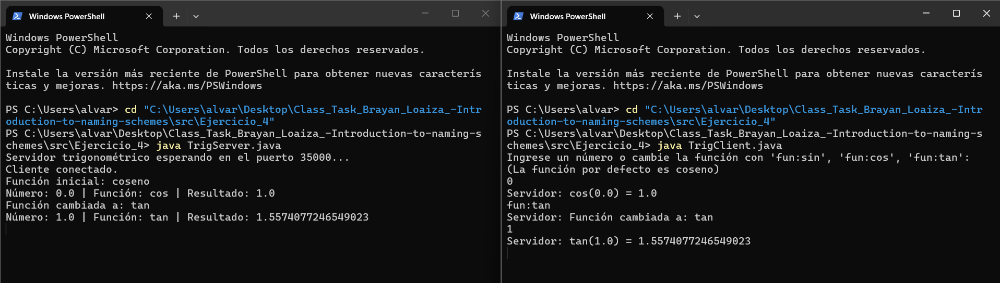

# Exercise 4 — TCP Trigonometry Server

A TCP client-server app where the server applies a trigonometric function (sin, cos, or tan) to numbers sent by the client. The active function can be switched at any time.

## How it works

- The server starts with **cosine** as the default function
- Send a number → get the result of the current function applied to it
- Send `fun:sin`, `fun:cos`, or `fun:tan` → switch the active function
- Angles are in **radians**

## Code

### `TrigServer.java`

```java
import java.io.*;
import java.net.*;

public class TrigServer {
    public static void main(String[] args) throws IOException {
        ServerSocket serverSocket = new ServerSocket(35000);
        System.out.println("Trig server listening on port 35000...");

        Socket clientSocket = serverSocket.accept();
        PrintWriter out = new PrintWriter(clientSocket.getOutputStream(), true);
        BufferedReader in = new BufferedReader(new InputStreamReader(clientSocket.getInputStream()));

        String currentFn = "cos";
        String inputLine;

        while ((inputLine = in.readLine()) != null) {
            if (inputLine.startsWith("fun:")) {
                String fn = inputLine.substring(4).trim();
                if (fn.equals("sin") || fn.equals("cos") || fn.equals("tan")) {
                    currentFn = fn;
                    out.println("Function changed to: " + currentFn);
                } else {
                    out.println("Unknown function. Use sin, cos or tan.");
                }
            } else {
                try {
                    double number = Double.parseDouble(inputLine);
                    double result = switch (currentFn) {
                        case "sin" -> Math.sin(number);
                        case "tan" -> Math.tan(number);
                        default    -> Math.cos(number);
                    };
                    out.println(currentFn + "(" + number + ") = " + result);
                } catch (NumberFormatException e) {
                    out.println("Error: '" + inputLine + "' is not a valid number.");
                }
            }
        }

        out.close(); in.close();
        clientSocket.close(); serverSocket.close();
    }
}
```

### `TrigClient.java`

```java
import java.io.*;
import java.net.*;

public class TrigClient {
    public static void main(String[] args) throws IOException {
        Socket socket = new Socket("127.0.0.1", 35000);
        PrintWriter out = new PrintWriter(socket.getOutputStream(), true);
        BufferedReader in = new BufferedReader(new InputStreamReader(socket.getInputStream()));
        BufferedReader stdIn = new BufferedReader(new InputStreamReader(System.in));

        System.out.println("Send a number, or switch function with fun:sin / fun:cos / fun:tan");

        String userInput;
        while ((userInput = stdIn.readLine()) != null) {
            out.println(userInput);
            System.out.println("Server: " + in.readLine());
        }

        out.close(); in.close(); socket.close();
    }
}
```

## How to run

Open **two terminals** in the `Ejercicio_4` folder:

**Terminal 1 — Server:**
```bash
javac TrigServer.java
java TrigServer
```

**Terminal 2 — Client:**
```bash
javac TrigClient.java
java TrigClient
```

**Example interaction:**
```
> 0
Server: cos(0.0) = 1.0
> fun:sin
Server: Function changed to: sin
> 0
Server: sin(0.0) = 0.0
> fun:tan
Server: Function changed to: tan
> 0.7853981633974483
Server: tan(0.785...) = 1.0
```

## Useful angle values

| Angle | Radians | sin | cos | tan |
|-------|---------|-----|-----|-----|
| 0° | `0` | 0.0 | 1.0 | 0.0 |
| 45° | `0.7853981633974483` | ≈0.707 | ≈0.707 | 1.0 |
| 90° | `1.5707963267948966` | 1.0 | ≈0.0 | ∞ |
| 180° | `3.141592653589793` | ≈0.0 | -1.0 | ≈0.0 |

## Evidence


